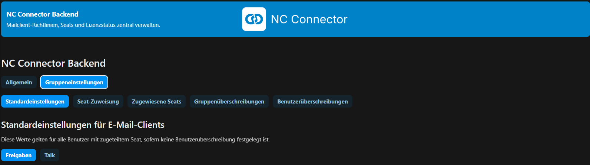

  

  <b>Central policy and template backend for NC Connector.</b> 
  Seats, policies, templates, signatures, and password delivery for Thunderbird and Outlook Classic.

# NC Connector Server Backend

NC Connector Server Backend is the optional Nextcloud app for organizations that want central control over NC Connector clients.

The mail add-ons can work directly with a Nextcloud account. The backend is used when admins need shared defaults, locked settings, seat assignment, templates, managed signatures, or separate password delivery rules.

## What The Backend Does

- assign seats to Nextcloud users
- deliver effective Share, Talk, and email-signature policies to the clients
- define which settings users may still change in the add-on
- manage Share, password-mail, Talk invitation, and email-signature templates
- provide user and group overrides for teams with different rules
- control separate password delivery as plaintext mail or Nextcloud Secret link
- expose setup state so Thunderbird and Outlook can explain backend problems clearly

## Backend Or No Backend

| Use case | Without backend | With backend |
|---|---|---|
| Local file sharing from the mail client | Yes | Yes |
| Talk rooms from calendar events | Yes | Yes |
| Central seat assignment | No | Yes |
| Admin-locked Share/Talk defaults | No | Yes |
| Central email signatures | No | Yes |
| Custom templates for Share, Talk, and password mails | No | Yes |
| Separate password delivery policies | No | Yes |
| Nextcloud Secret links for password delivery | No | Yes, with the Secrets app |

## Policy Model

The backend resolves settings in this order:

1. user override
2. group override
3. default settings

Clients receive the resolved values plus editable flags. That lets admins lock selected options while still showing users which values are active.

Policy areas:

- Share defaults and permissions
- password behavior and expiration days
- separate password delivery mode
- Talk room defaults
- email-signature behavior for compose, reply, and forward
- template language and custom template usage

## Seats And License Modes

Community mode includes one local seat and does not require a license lookup.

Pro mode uses the NC Connector license backend and supports team use with more seats. Seats map to Nextcloud users and can be reassigned by admins.

Admin accounts are not assigned by default. If an organization deliberately wants that, a server admin can enable it with the documented `occ ncc:admin-seat-assignment` command.

## Templates And Signatures

Admins can manage central HTML templates for:

- Share blocks
- separate password mails
- Talk invitations
- email signatures

Templates are edited in the backend UI and sanitized before they are stored. Email signatures can use Nextcloud profile values and per-user override fields for matching email address, mobile phone, and custom values.

If a signature placeholder has no value, the backend removes the empty line or table row before returning the rendered HTML to Thunderbird or Outlook.

## Password Delivery And Secrets

Separate password delivery is a backend feature.

Supported modes:

- `plain`: send the password in a separate mail
- `secrets`: send an expiring Nextcloud Secrets link

If the Nextcloud Secrets app is missing or disabled, the runtime policy returns `null` for the Secrets mode values. Clients then fall back to the existing plaintext password mail behavior instead of blocking the user.

The default Secrets link lifetime is 7 days.

## Requirements

- Nextcloud 31 through 34
- PHP 8.1 or newer
- NC Connector for Thunderbird or NC Connector for Outlook Classic
- Nextcloud Files Sharing
- optional: Nextcloud Talk
- optional: Nextcloud Secrets for Secret-link password delivery

## Installation

1. Install the app from the [Nextcloud App Store](https://apps.nextcloud.com/apps/ncc_backend_4mc) or from a release archive.
2. Enable the app in Nextcloud.
3. Open **Administration settings -> NC Connector**.
4. Choose Community or Pro mode.
5. Assign seats.
6. Configure Share, Talk, signatures, templates, and password delivery.
7. Save the settings and test from Thunderbird or Outlook.

## Client Repositories

- [NC Connector for Thunderbird](https://github.com/nc-connector/NC_Connector_for_Thunderbird)
- [NC Connector for Outlook Classic](https://github.com/nc-connector/NC_Connector_for_Outlook)

## Documentation

- [Admin documentation](Doku/admin.md)
- [Development notes](Doku/development.md)
- [Changelog](CHANGELOG.md)
- [Translations](Translations.md)
- [Third-party licenses](VENDOR.md)

## Screenshots

<strong>Backend settings</strong>

|  |
| --- |

<strong>Template editor</strong>

|  |
| --- |

<strong>Email signatures</strong>

|  |
| --- |

